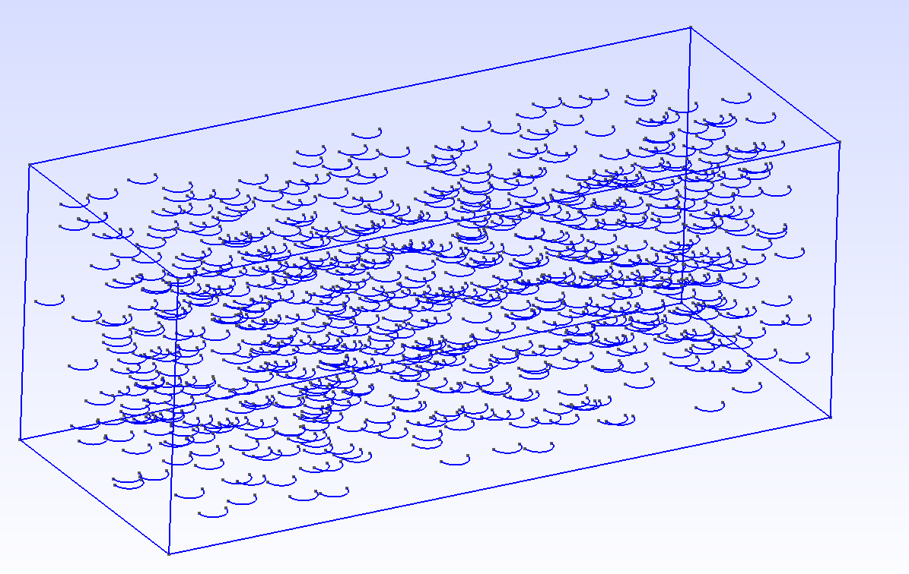
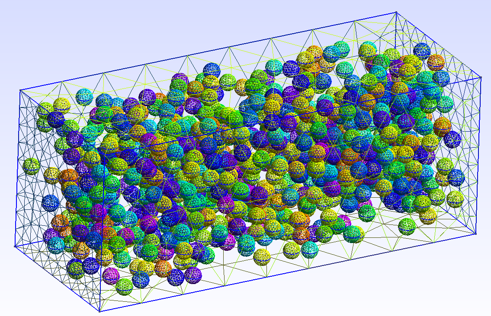
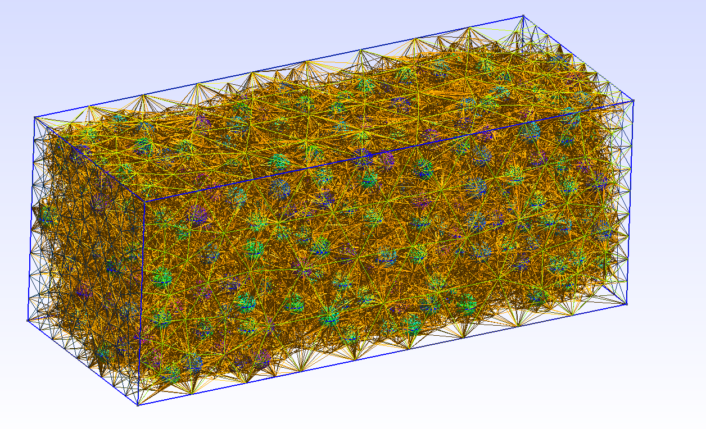

# Gmsh-disperse
---
#### Данный python-скрипт позволяет генерировать трёхмерную случайную дисперсную структуру, состоящую из сферических неконтактирующих частиц. Алгоритм основан на методе "вязкой суспензии". При выборе "Fragments" расчётная область заполняется сферами, при выборе "Difference" генерируются пустоты.
#### Результатом работы является готовый для построения трёхмерной сетки GMSH-файл.
#### В настоящий момент скрипт ограничен работой только с элементами Gmsh типа "Box".
#### Принцип работы. В файле *.geo настраивается размер расчётной области (см. пример example/micro.geo), а в main.py устанавлюваются необходимые параметры (радиус частиц, их количество и коэффициент релаксации).
#### Если в течение продолжительного времени число итераций растёт, а прогресс не достигает 100%, тогда следует уменьшить число частиц или/и коэффициент релаксации.
---
#### This python script allows you to generate a three-dimensional random dispersed structure consisting of spherical non-contacting particles. The algorithm is based on the "viscous suspension" method. When "Fragments" is selected, the computational area is filled with spheres, when "Difference" is selected, voids are generated.
#### The result of the work is a GMSH-file ready for building a three-dimensional mesh.
#### At the moment the script is limited to work only with Gmsh elements of "Box" type.
#### How to work. In the *.geo file, the size of the computational domain is set (see example/micro.geo), and the necessary parameters are set in main.py (radius of particles, their number and relaxation rate).
#### If for a long time the number of iterations grows, and the progress does not reach 100%, then the number of particles and/or the relaxation coefficient should be reduced.
---

